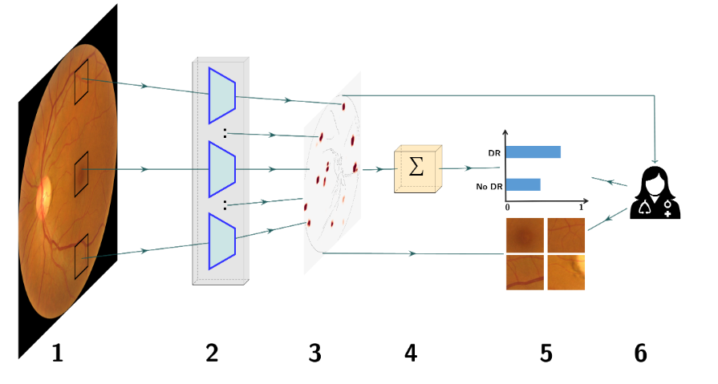
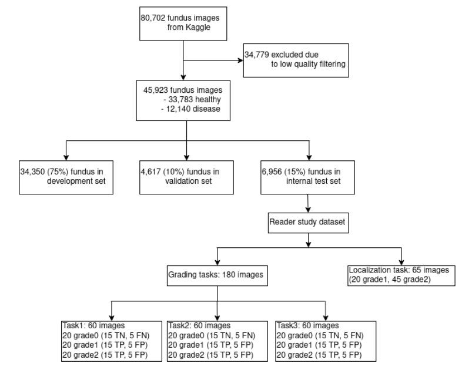

# Sparse-BagNet validation: An Inherently Interpretable AI model improves Screening Speed and Accuracy for Early Diabetic Retinopathy
This repository contains the official implementation of the paper [An Inherently Interpretable AI model improves Screening Speed and Accuracy for Early Diabetic Retinopathy](https://www.medrxiv.org/content/10.1101/2024.06.27.24309574v1).

## Model's architecture


## Development dataset



## Dependencies
All packages required for running the code in the repository are listed in the file _`requirements.txt`_

## Data \& Preprocessing
### Data
The code in this repository uses publicly available Kaggle dataset from the [diabetic retinopathy detection challenge](https://www.kaggle.com/c/diabetic-retinopathy-detection/data)

### Preprocessing
The images were preprocessed by tightly cropping circular masks of the retinal fundus and resize to 512 x 512. The code is available here: [fundus preprocessing](https://github.com/berenslab/fundus\_circle\_cropping)

An ensemble of EfficientNets trained on the [ISBI2020 challenge dataset](https://isbi.deepdr.org/challenge2.html) was used to filter out images with low qualities. The resulting dataset (csv files) used to train the model and for internal evaluation is as follows: 
- [`training csv file`](./files/csv_files/kaggle_gradable_train.csv)
- [`validation csv file`](./files/csv_files/kaggle_gradable_val.csv)
- [`test csv file`](./files/csv_files/kaggle_gradable_test.csv) 

The image names used for figures are provided in [`images.txt`](./files/image.txt)

## How to use: training
### 1. Organize the dataset as follows:
```
├── main_folder
    ├── Kaggle_data
        ├── Images
        ├── kaggle_gradable_train.csv
        ├── kaggle_gradable_test.csv
        ├── kaggle_gradable_val.csv 
    ├── Outputs
    ├── configs
    ├── data
    ├── files
    ├── utils
    ├── modules  
    ├── main.py
    ├── train.py
```

Adjust paths to dataset in `configs/paths.yaml`. Replace the value of
- `root` with `Kaggle_data/`
- `img_dir` with `Images/`

Adjust paths in `configs/default.yaml`. Replace the value of
- `save_paths` with `xx` where `xx` is where the log files and model weights will be saved during the model training
- `paths.model_dir` with `xx`

### 2. Update the training configurations and hyperparameters 
All experiments are fully specified by the configuration file located at `./configs/default.yaml`.

The training configurations including hyperparameters turning can be done in the main config file.

### 3. Run to train
- Create a virtual environment and install dependencies 
```shell
$ pip install requirements.txt
```
- Run a model with previously defined parameters
```shell
$ python main.py
```

### 4. Monitor the training step 
Monitor the training progress in website [127.0.0.1:6006](127.0.0.1:6006) by running:

```
$ tensorborad --logdir=/path/to/your/log --port=6006
```

## Reproducibility
### Figures and annotations
- Code for figures are available

### Retrospective reader study
- CSV file of the 180 images with ground truth level used for the grading tasks is available at [grading dataset](./user_study/grading_task_dataset.csv)
- CSV file containing the outcome of the grading tasks (including the model output and the ophthalmologists's performance such as the decision time, confidence, and grade) is available at [grading dataset](./user_study/grading_task_outcome.csv)
- CSV file of the 65 images with ground truth level used for the annotation task is available in [annotation dataset](./user_study/annotation_task_dataset.csv)
- Annotations masks from clinicians used to evaluate the performance of the model on localizing DR related lesion on the internal set is available at [annotation dataset](./user_study/annotation_task_outcome.csv). The annotation only include Microaneurysm (MA), Hemorrhages (HE), Hard Exudates (HE), and Soft Exudates (SE) lesions. 

### Models's weights
The final models with the best validation weights used for all the experiments are as follows:
- [ResNet model](https://drive.google.com/file/d/19uxCKAGI7B29tL0C89ZRnUaSSfjf01wp/view?usp=drive_link)
- [Sparse-BagNet model](https://drive.google.com/file/d/1-BlykANm7bhJytlg25laWIeLZAtihYUU/view?usp=drive_link)

## Acknowledge
-  This repository contains modified source code from [kdjoumessi/interpretable-sparse-activation](https://github.com/kdjoumessi/interpretable-sparse-activation) 

## Citation
```
  @inproceedings{donteu2023sparse,
  title={An Inherently Interpretable AI model improves Screening Speed and Accuracy for Early Diabetic Retinopathy},
  author={Kerol Djoumessi, Ziwei Huang, Annekatrin Rickmann, Natalia Simon, Laura Kühlewein, Lisa M. Koch, Philipp Berens},
  booktitle={xx},
  year={2024}
}
```

This work includes code adaptations from [Sparse BagNet](https://github.com/kdjoumessi/interpretable-sparse-activation) [(Djoumessi et al., 2023)](https://openreview.net/forum?id=us8BFTsWOq):
```
  @inproceedings{donteu2023sparse,
  title={Sparse Activations for Interpretable Disease Grading},
  author={Donteu, Kerol R Djoumessi and Ilanchezian, Indu and K{\"u}hlewein, Laura and Faber, Hanna and Baumgartner, Christian F and Bah, Bubacarr and Berens, Philipp and Koch, Lisa M},
  booktitle={Medical Imaging with Deep Learning},
  year={2023}
}
```
